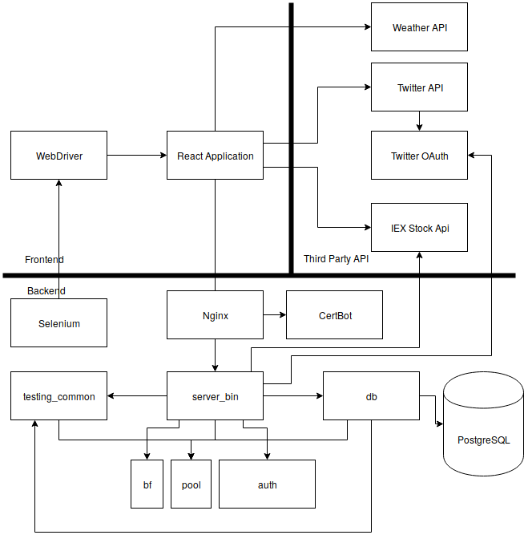

# Design Document
Team 3

### UML Class Diagram

### Sequence diagrams
##### Authentication

##### Stock Trading

##### Stock Trading Display

### Component Architecture

### Design Rationale
##### Backend
The backend consists of two primary parts, with some additional utilities.
The `db` crate and the `server` crate are these primary components.
The `db` crate is responsible for defining the types that will be inserted into the database, as well as the ORM code for querying the database.
There is often one type that represents all columns of a table, and then specialized smaller types used for inserting or changing rows in the table.
ORM functions are statically tied to these big types.

The `server` crate is responsible for defining the routes that will match requests, and piping those requests through business logic and into the ORM functions. 
`server_bin` is the binary that explicitly relies on the `server` crate/lib.

The `testing_common` (name pending) crate is responsible for handling the logic for resetting databases for every integration test, as well as defining the `Fixture` abstraction used for integration tests.

The `auth` crate is responsible for authentication tasks, like issuing and verifying JWT tokens, as well as handling the keys that make this possible.
It was small and uncoupled enough to be broken into its own library.

The `pool` crate is responsible for configuring the database connection pool used both by the server and testing common crates.
`pool` is its own crate instead of being in `db` to avoid a circular dependencies when `db` needs to rely on `testing_common` when integration testing.

The multi-library arrangement is good for separating code into distinct, manageable sections.
`db` ends up being responsible for database calls, while `server` is responsible for business logic, error handling, and request routing.

### Deployment Plan
1. Provision VM.
2. Clone/Copy the repository to the VM.
3. Install docker and docker-compose.
4. Run docker-compose up -d to build, configure, and deploy the application.

### Test Plan
* Mostly integration tests on the backend. Unit tests where applicable.
  * Tests will be run using Rust's built in testing framework.
  * Henry is responsible for creating and running backend tests.
  * Unit tests aren't particularly feasible because most of the backend logic is represented as ORM functions, which explicitly requires a database connection.
  * What isn't directly dependent on ORM calls will be unit tested.
  * The ORM-dependent nature of the app does lend itself well to integration tests.
    * For each integration test, the database is reset and repopulated per a customizable Fixture type.
    * For a fixture's code under test to run, it must first acquire a global lock on the test database connection, defeating Rust's multi-threaded testing default behavior.
    * This ensures mostly deterministic behavior.
  * All tests must pass in order to merge a branch into master.
    * This is enforced socially, we are too lazy to set up a CI suite.
* Likely no CI service, devs are expected to test locally before merging to master.
* Unit and webdriver tests on the frontend.
